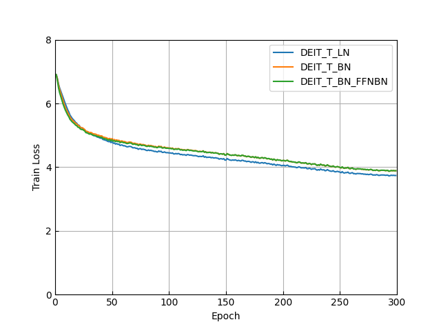
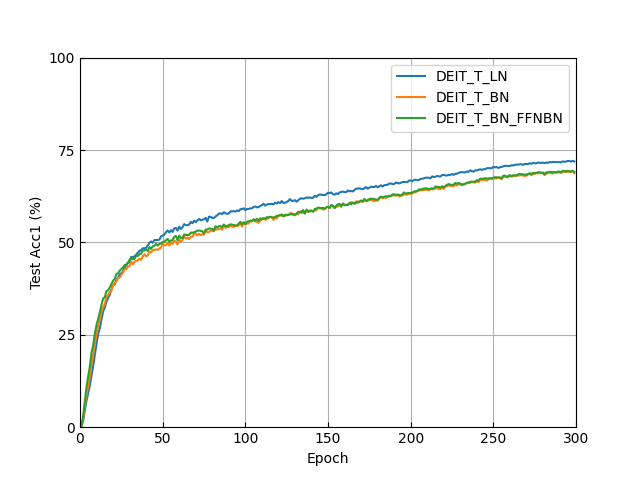

# BatchNorm in Vision Transformers (BN-ViT)

Unofficial pytorch implementation of paper [Leveraging Batch Normalization for Vision Transformers](https://openaccess.thecvf.com/content/ICCV2021W/NeurArch/html/Yao_Leveraging_Batch_Normalization_for_Vision_Transformers_ICCVW_2021_paper.html) (ICCVW 2021).

Test results on DeiT_Tiny are shown below, corrsponding to Figure 2 in paper.

<div align=left>


</div>

## Requirements

-   pytorch == 1.13.1
-   timm == 0.9.2

## Usage

```python
from utils_bn import replace_BN
model = timm.create_model('vit_tiny_patch16_224')
model = replace_BN(model)
```

The current `replace_BN` only supports the [ViT models in timm](https://github.com/huggingface/pytorch-image-models/blob/main/timm/models/vision_transformer.py).

## BN-ViT Models

-   replace all Layer Normalization (LN) layers with Batch Normalization (BN) layers, resulting in training crashes (crashes is reported in the paper, but not shown in this implementation, maybe due to additional replacement `model.norm` before `model.head`)
-   add a BN layer in-between two linear layers in Feed Forward Network (FFN) blocks to stabilize training

## Test on DeiT_Tiny

We report the last epoch accuracy and provide the last epoch checkpoints in [Releases](https://github.com/zeyuanyin/BN-ViT/releases).

| model | DeiT_T_LN | DeiT_T_BN | DeiT_T_BN_FFNBN |
| :---: | :-------: | :-------: | :-------------: |
| acc@1 |   71.89   |   68.70   |      69.04      |

## Reference

Yao, Zhuliang, Yue Cao, Yutong Lin, Ze Liu, Zheng Zhang, and Han Hu. "Leveraging batch normalization for vision transformers." In Proceedings of the IEEE/CVF International Conference on Computer Vision, pp. 413-422. 2021.
